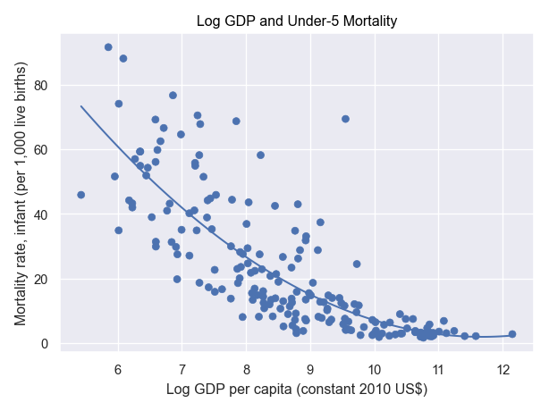

### Describe Log GDP per capita (constant 2010 US$):
| Statistics | Value |
| ----- | ----- |
| count | 198.00 |
| mean | 8.70 |
| std | 1.47 |
| min | 5.43 |
| 25% | 7.52 |
| 50% | 8.72 |
| 75% | 9.78 |
| max | 12.15 |

### Describe Mortality rate, infant (per 1,000 live births):
| Statistics | Value |
| ----- | ----- |
| count | 193.00 |
| mean | 23.40 |
| std | 21.06 |
| min | 1.70 |
| 25% | 6.50 |
| 50% | 15.50 |
| 75% | 35.10 |
| max | 91.60 |

